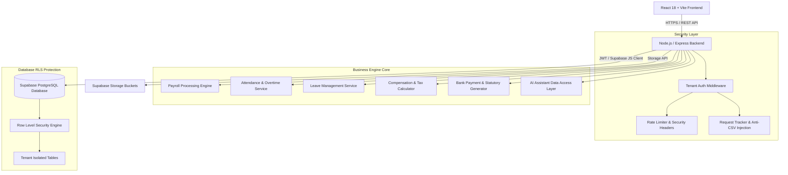

# Enterprise Payroll SaaS — System Architecture

---

## Data Flow Lifecycle

1. **Company & Employee Management**: HR Admin sets up branches, departments, employees, and salary structures.
2. **Time & Leave Processing**: Attendance feeds into daily calculation routines; leaves are validated against accrual ledgers.
3. **Payroll Processing Run**: HR creates a Payroll Period, triggers batch calculation (Gross, Deductions, PF, ESI, PT, TDS, Net Salary).
4. **Approval & Finalization**: Payroll calculation validated, approved by HR/Finance, finalized (snapshotting records).
5. **Document & Payment Processing**: Payslips generated as PDF; Bank transfer files (ICICI, HDFC, SBI, Axis) generated along with statutory reports (EPFO ECR, ESI, Form 16, PT).
6. **Self-Service & AI Support**: Employees view payslips & apply for leaves; HR uses AI assistant for query resolution under strict permission filters.
